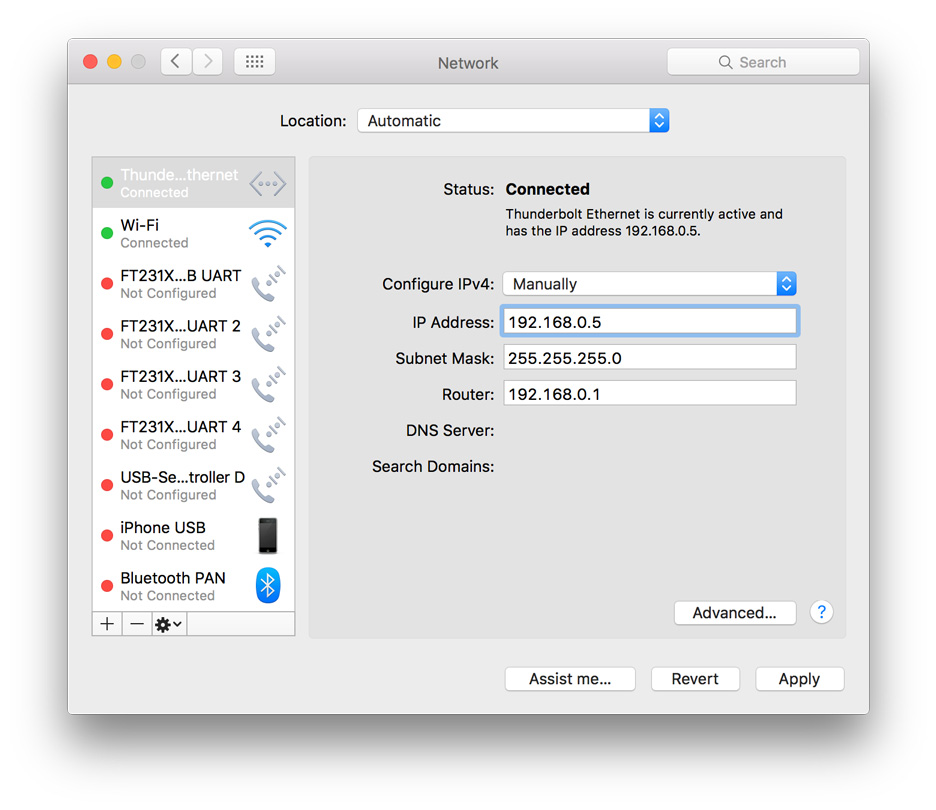

<h2> ITP Unconference 2016 </h2>  

<h3> Getting acquainted with the RaspberryPi </h3>  

---

<h4>A step-by-step guide to setting up your Pi</h4>

This guide focuses on the Pi Models 1 & 2, not the Zero, and is an extension of Surya Mattu's 2015 Unconference session ( which can be found here: https://github.com/samatt/RasberryPiSetup ).

 As per Surya's repo, you can find a concise explanation of the difference between a Pi and Arduino:  

https://blog.adafruit.com/2012/06/18/ask-an-educator-whats-the-difference-between-arduino-raspberry-pi-beagleboard-etc  

Raspberry Pi's website explains the differences between the different models:  

https://www.raspberrypi.org/documentation/hardware/raspberrypi/models/README.md  

<b>It's important to note that his setup guide is for the JESSIE LITE raspbian distribution.  The instructions for connecting to the Pi remotely are for Mac OSX only.</b>  
<nbr>
If you want to set up your Pi for an application that requires a screen and has a desktop operating system, you can download the easy-to-use [NOOBS OS Installer](https://www.raspberrypi.org/downloads/noobs/).  You can follow <b>Step 1</b> to copy the image to your SD card.

---

<h5>What you'll need:</h5>
<ul>
  <li> A RaspberryPi</li>
  <li> A laptop/computer with an SD card reader </li>
  <li> An microSD card ( 8GB, class 6 ) is recommended.  *The class refers to the read/write speed of the card. </li>
  <li> USB cable (check your pi for the size) </li>
  <li> A screen with an HDMI port</li>
  <li> An HDMI cable </li>
  <li> A USB keyboard </li>
  <li> An ethernet cable </li>
  <li> An ethernet adapter if you don't have an ethernet port </li>
</ul>

---  

<h5>Step 1: Downloading and installing the OS</h5>

Your Pi is small computer, and all computers need an operating system (OS) to be of any use, so let's install one. The first thing you need to do is format the SD card.

<ul>
<li>Download the SD Association's Formatting Tool from https://www.sdcard.org/downloads/formatter_4/eula_mac/ </li>
<li>Install and run the Formatting Tool on your machine</li>
<li>Select "Overwrite Format"</li>
<li>Give the disk a name that'll be easy to identify ( I just called mine 'Pi' ).</li>
<li>Check that the SD card you inserted matches the one selected by the Tool</li>
<li>Click the "Format" button (Be patient, this can take a while if you have a large card).</li>
</ul>

We're going to be installing the RASPBIAN JESSIE LITE (this is the command line only operating system).  Feel free to install any of the other OSs, but this guide will be covering the JESSIE LITE only.

https://www.raspberrypi.org/downloads/raspbian/  

Now we're going to be be writing the disk image, that you've just downloaded, onto the microSD card using the command line.

<ul>
<li>Extract the raspbian-jessie-lite.zip file.</li>
<li>Drag the raspbian-jessie-lite.dmg file into/onto your desktop.</li>
<li>Open up Terminal.  With the SD card still inserted in your laptop/computer, type the following command into your terminal window:</li>
  <pre>diskutil list</pre>
<li>You should see something like this:</li>

<li>The easiest way to identify which disk is your SD card is to look for the name you gave it during formatting. You should also recognise it based on its size ( mine's a 16GB card ).</li>
<li>You can see clearly that mine is <b>/dev/disk2</b>.</li>
<li>unmount you card by typing the following command (you'll be substituting <b>disk2</b> for whatever you identified your SD card to be): <pre>diskutil unmountDisk /dev/<b>disk2</b></pre> . </li>
<li>Now we're going to copy the disk image to the SD card. In terminal, navigate to your desktop folder (you can do this by typing <pre>cd </pre> followed by a space, then drag the desktop folder from your finder window into terminal. You'll see the command line populate with your desktop folder's path. Press Enter.</li>
<li>Type in <pre>ls -l</pre> and hit Enter.  You should see a list of all the files and folders on your desktop.  Scroll up and copy the name of your disk OS disk image by highlighting it with your cursor and using the keyboard shortcut cmd+C </li>
<li>Now type in the following command (remember to replace the img name, and the disk name, that are in bold with those of your own image and disk):
<pre>sudo dd bs=1m if=<b>2015-11-21-raspbian-jessie-lite.img</b> of=/dev/r<b>disk4</b></pre>
<li>Hit Enter. And you should be prompted to enter your password. If it was successful, the cursor will just be flashing on a blank line.  You can check that there is copying taking place by hitting the Ctrl+T keyboard shortcut.</li>
<li>Eject the disk (Using Disk Utility or in Finder) and place it in your RaspberryPi.</li>
</ul>

<b>Troubleshooting:</b>

If you encounter the error: <pre>dd: invalid number '1m'</pre>

try replacing the '1m' in the previous command with '1M' <pre>sudo dd bs=<b>1M</b> if=2015-11-21-raspbian-jessie-lite.img of=/dev/rdisk4</pre> (remembering to subsitute the img name and disk for your own).

If it still doesn't work, consult the [Troubleshooting guide](https://www.raspberrypi.org/documentation/installation/installing-images/mac.md)

---

<h5>Step 2: Setting up a new user</h5>

Plug in your USB keyboard and HDMI cable before powering up your Pi with the USB cable.

Once the boot sequence has completed, you'll be asked to login. Enter the default username:

<pre>pi</pre>

followed by the default password:

<pre>raspberry</pre>

Setting up a new user is recommended and more secure, but not necessary, so feel free to skip to Step 3 if you're happy with the defaults provided.

To create new user, type the following command (replacing the name in bold with the name you choose).

<pre>sudo adduser <b>craig</b></pre>

you'll be prompted to enter a password of your choosing. Once selecting your password you'll be prompted to fill in the user's details such as name, number etc.. feel free to leave those blank by just hitting Enter.

Before switching to your new user, we need to five it sudo privilages. The default pi user on Raspbian is a sudoer. This gives the ability to run commands as root when preceded by sudo, and to switch to the root user with sudo su.

To give your new user sudo privilages, type the following command:</p?
<pre>sudo visudo</pre>

This will open the <b>/etc/sudoers</b> file.  Search for the line that says:

<pre>root  ALL=(ALL:ALL) ALL</pre>

and add the following line under it (remembering to substitute your own username for the one in bold)

<pre><b>craig</b>  ALL=(ALL:ALL) ALL</pre>

To exit the document, use the keyboard shortcut Ctrl+X, then hit 'Y', then hit Enter. 

To switch to your user, type the following command (substituting in your own username):

<pre>su <b>craig</b></pre>

---

<h5>Step 3: Setting up the Pi's network interface</h5>

We'll be connecting directly to the Pi using an Ethernet cable.  To do this, we need to set a static IP on the eth0 port.  We do this by editing the dhcp config file.  To open the file, type in the following command:

<pre>sudo nano /etc/dhcpcd.conf</pre>

'nano' is simply the default text editor, so the above command is saying that we want to open the config file using the nano text editor.

Add the following lines to the bottom of the document:

<pre>
interface eth0
static ip_address=192.168.0.10
static routers=192.168.0.1
static domain_name_servers=192.168.0.1
</pre>

To save the document, use the keyboard shortcut Ctrl+X, followed by 'y', followed by enter.

Plug the ethernet cable into your laptop and the Pi.</pi>

Now we need to reboot the network interface.  Do this using the following command:

<pre>sudo ifdown eth0 && sudo ifup eth0</pre>

To check that everything is working, type the following command:

<pre>ifconfig</pre>

Your results should look something like this:

<pre>
eth0      Link encap:Ethernet  HWaddr b8:27:eb:cb:6f:43  
          inet addr:192.168.0.10  Bcast:192.168.0.255  Mask:255.255.255.0
          inet6 addr: fe80::6e9b:57b0:2d93:2c09/64 Scope:Link
          UP BROADCAST RUNNING MULTICAST  MTU:1500  Metric:1
          RX packets:330 errors:0 dropped:0 overruns:0 frame:0
          TX packets:282 errors:0 dropped:0 overruns:0 carrier:0
          collisions:0 txqueuelen:1000 
          RX bytes:45307 (44.2 KiB)  TX bytes:37909 (37.0 KiB)
</pre>

Take note of the <b>inet addr</b> and <b>Mask</b>, we'll be using these to set the network interface for your laptop.
  

Go to your System Preferences > Network

You'll want to locate your ethernet port, or the adapter port, from the list provided.  In the dropdown menu next to 'Configure IPv4' select <b>manually</b>

Fill in the fields according to the image below, ensuring that the subnet mask is the same ifconfig's Mask on your Pi.  The IP address should be the same as your Pi, except for the last digit which can be anything between 0-99, as long as it is not the same as your Pi's or the Router.

Click <i>Apply</i> and open up Terminal again.

To test that the connection is working, type in the following (provided you set your Pi's IP address to the same as mine):

<pre>ping 192.168.0.10</pre>

If the connection has succesfully been established, you should see results like this (use the keyboard shortcut Ctrl+C to stop pinging your Pi):

<pre>
172-16-216-16:~ Craig$ ping 192.168.0.10
PING 192.168.0.10 (192.168.0.10): 56 data bytes
64 bytes from 192.168.0.10: icmp_seq=0 ttl=64 time=0.542 ms
64 bytes from 192.168.0.10: icmp_seq=1 ttl=64 time=0.339 ms
64 bytes from 192.168.0.10: icmp_seq=2 ttl=64 time=0.384 ms
64 bytes from 192.168.0.10: icmp_seq=3 ttl=64 time=0.409 ms
64 bytes from 192.168.0.10: icmp_seq=4 ttl=64 time=0.409 ms
64 bytes from 192.168.0.10: icmp_seq=5 ttl=64 time=0.350 ms
64 bytes from 192.168.0.10: icmp_seq=6 ttl=64 time=0.291 ms
--- 192.168.0.10 ping statistics ---
7 packets transmitted, 7 packets received, 0.0% packet loss
round-trip min/avg/max/stddev = 0.291/0.389/0.542/0.074 ms
</pre>

---

<h5>Step 4: Connecting to your Pi</h5>

From this point onwards, you no longer need a screen and keyboard to access your Pi.

<i>Secure Shell</i> (SSH)is a command interface and protocol for securely getting access to a remote computer.  We'll be using SSH to transfer files and access the Pi remotely. This means that you can now access the Pi without needing a screen or keyboard.

To SSH into your Pi, type the following command:

<pre>
sudo ssh <b>your_pi_username</b>@<b>your_pi_IPaddress</b>
eg. sudo ssh craig@192.168.0.10
</pre>

If asked about RSA key authentication, simply type 'yes'

You should now be logged into you Pi.

Let's test the connection by copying across a file using SCP (secure copy protocol).

Open up a new terminal window, you can create a new tab in your existing terminal using Cmd+T (keep the terminal window that you SSH'd into you Pi open).

Create a new file that you'll be copying over.  To create a test text file, type the following command:

<pre>echo this is some sample text >> test.txt</pre>

This should have created a text file called <i>test.txt</i> in your present working directory. To check if it's there, type the following command:

<pre>ls -l</pre>

You should see the test.txt file in the list of files, like the one below:

<pre>
172-16-216-16:Desktop Craig$ ls -l
total 3389224
-rw-r--r--@  1 Craig  staff  1458569216 Nov 21 21:32 2015-11-21-raspbian-jessie-lite.img
-rw-r-----@  1 Craig  staff       13712 Jan  9 14:29 CXvbW1lWcAAl5z_.jpg
-rw-r--r--   1 Craig  staff   276026159 Dec  9 17:59 Craig.zip
-rw-r-----@  1 Craig  staff       22689 Jan  2 23:31 Twitter_logo_blue.png
drwxr-xr-x   3 Craig  staff         102 Apr 25  2015 basic_depth
-rw-r-----@  1 Craig  staff        6129 Dec 14 12:12 castle.png
drwxr-xr-x  32 Craig  staff        1088 Dec 15 00:12 demo
-rw-r--r--@  1 Craig  staff       74334 Dec  7 16:24 schematic.png
<b>-rw-r--r--   1 Craig  staff          20 Jan 22 11:51 test.txt</b>
-rw-r--r--   1 Craig  staff      430629 Jan  2 21:03 three.min.js
-rw-r-----@  1 Craig  staff       91807 Jan  6 16:52 tumblr_nuzyppVxQN1uqyj3lo1_1280.png
-rw-------   1 Craig  staff       22130 Nov 16 19:31 widget-com.apple.widget.stickies.plist
172-16-216-16:Desktop Craig$ 
</pre>

You need to know the path of where you want to copy your file to, switch tabs back to the window that's logged into your Pi and type:

<pre>pwd</pre>

This will give you the present working directory for your Pi, which'll look something like this:

<pre>
craig@raspberrypi:~ $ pwd
<b>/home/craig</b>
</pre>

Switch back to the window and repeat the previous step.  My path looks like this:

<pre>
Craigs-MacBook-Pro:Desktop Craig$ pwd
<b>/Users/Craig/Desktop</b>
</pre>

Now that we have both the source and destination paths, we can perform the copy.  To perform the copy, type the following command (substituting my file paths for your own): 

<pre>
<b>scp /path/to/file username@a:/path/to/destination</b>
eg. scp /Users/Craig/Desktop/test.txt craig@192.168.0.10:/home/craig
</pre>

Enter the password for your Pi's username when prompted to do so! If the copy is successful, you'll see a message like this in the console: 

<pre>
Craigs-MacBook-Pro:Desktop Craig$ scp /Users/Craig/Desktop/test.txt craig@192.168.0.10:/home/craig
craig@192.168.0.10's password: 
test.txt                                      100%   20     0.0KB/s   00:00 
</pre>

To double check, switch to your Pi's terminal window and type the following command:

<pre>ls -la</pre>

You can see from my console that the file copied successfully!

<pre>
craig@raspberrypi:~ $ ls -la
total 28
drwxr-xr-x 2 craig craig 4096 Nov 22 03:24 .
drwxr-xr-x 4 root  root  4096 Nov 21 22:03 ..
-rw------- 1 craig craig  589 Nov 22 02:05 .bash_history
-rw-r--r-- 1 craig craig  220 Nov 21 22:03 .bash_logout
-rw-r--r-- 1 craig craig 3512 Nov 21 22:03 .bashrc
-rw-r--r-- 1 craig craig  675 Nov 21 22:03 .profile
<b>-rw-r--r-- 1 craig craig   20 Nov 22 03:24 test.txt</b>
</pre>

---

---

<h5>Some useful commandline commands for the Pi</h5>

</pre>

Create a text file

<pre>
nano your_file_name.extension
<b>eg. nano test_file.py</b>
</pre>

Create a directory

<pre>mkdir your_directory_name</pre>

Delete a file:

<pre>sudo rm file_to_delete.extension</pre>

Delete a folder and all its contents:

<pre>sudo rm -rf folder_to_delete</pre>

Shutdown your Pi:

<pre>sudo shutdown now</pre>

Restart your Pi:

<pre>sudo shutdown -r now</pre>

Stop any and all scripts running in the background

<pre>sudo killall</pre>

